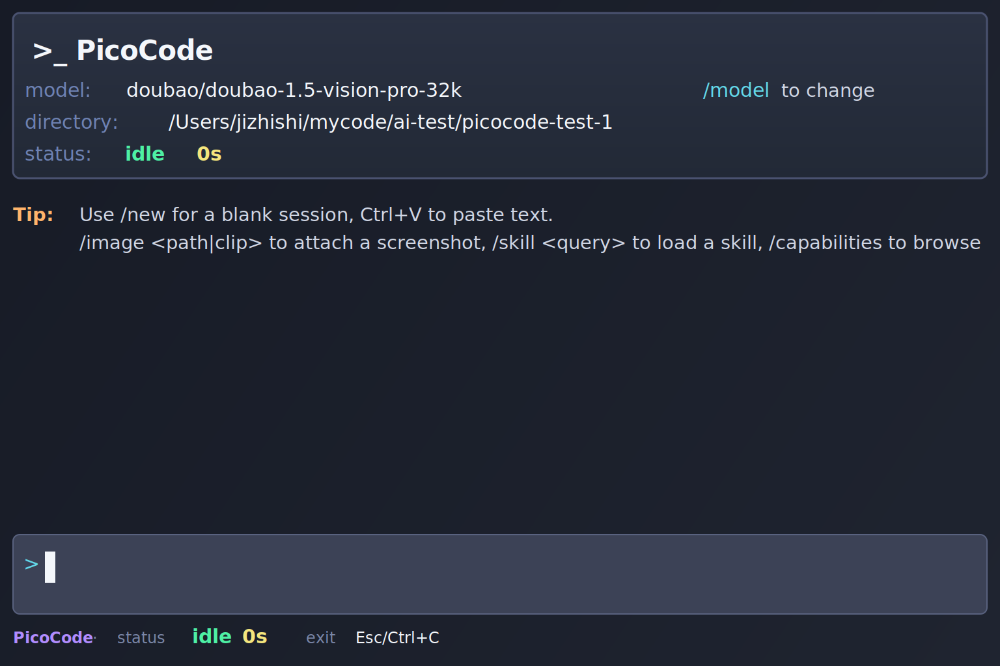

# PicoCode

`PicoCode` is a small, local-first coding agent workbench for the terminal.

It is inspired by Pi, Codex, Claude Code, and OpenCode, but keeps the implementation focused on a local-first Rust TUI.



## Status

`PicoCode` is an early learning project. It is useful, but still unstable and evolving.

It has only been tested on macOS so far.

## Comparison

`PicoCode` borrows ideas from Pi and OpenCode, but it is still much smaller in scope.

| Capability | PicoCode | Pi | OpenCode |
| --- | --- | --- | --- |
| Terminal workbench UI | Yes | Yes | Yes |
| Session resume / continue | Yes | Yes | Yes |
| Session tree / fork / compaction | Yes | Yes | Partial / lighter |
| Model switching | Yes | Yes | Yes |
| Image attachment | Yes | Yes | Yes |
| Command execution | Yes | Yes | Yes |
| Read / search / edit loop | Yes | Yes | Yes |
| Skills / capabilities discovery | Yes | Yes | Partial |
| Extension ecosystem | Very small / early | Richer | Richer |
| Cross-platform testing | macOS only | Broader | Broader |

## What it does

- TUI chat/workbench with a clean Codex-like layout
- Session resume, continue, tree browsing, fork, compaction, and export/share
- Model selection
- Capability discovery and skill loading
- Read-only code navigation with `find`, `search_text`, and `read`
- Editing with preview, apply, and rewind
- Command execution with live output and repair loop

## Installation

`PicoCode` is meant to be used as a standalone binary.

### One-line install

The intended public install entrypoint is a GitHub-hosted install script like this:

```bash
curl -fsSL https://raw.githubusercontent.com/shijizhi/picocode/main/install | bash
```

### From GitHub Releases

Download the archive for your platform from the Releases page, unpack it, and let the installer place `picocode` on your `PATH`.

### Optional: package managers

If we later publish package manager formulas, they will be listed here as well.

## Quick start

```bash
picocode
```

By default, `PicoCode` continues the most recent session if one exists.

To start a blank session:

```bash
picocode --new
```

## Point it at another project

Use `--project` to work against a different codebase:

```bash
picocode --project /path/to/project
```

This is the normal way to use `PicoCode` after installation.

## Development

If you are hacking on `PicoCode` itself, you can still run it from source:

```bash
cargo run -- --project /path/to/project
```

This is the recommended way to use `PicoCode` while developing it in RustRover or while keeping the `picocode` source tree separate from the target workspace.

For local install-script testing, use the script in the repository and set:

```bash
PICOCODE_REPO=jizhishi/picocode PICOCODE_VERSION=<tag> ./install
```

## Useful commands

```text
/new
/continue
/resume
/model
/tree
/fork
/compact
/capabilities
/capability <query>
/cap-enable <query>
/cap-disable <query>
/image <path>
/image clip
/skill <query>
/export
/share
```

## CLI

```text
picocode [--project <path>] --new
picocode [--project <path>] --continue
picocode [--project <path>] --resume
picocode [--project <path>] --session <session-id>
picocode [--project <path>] --tree
picocode [--project <path>] --fork <session-id>
picocode [--project <path>] --model
picocode [--project <path>] --capabilities
picocode [--project <path>] --skill <query>
picocode [--project <path>] --tool <name> ...
```

## Configuration

PicoCode works with any OpenAI-compatible provider.
The examples below use Doubao and Minimax only as reference configurations.

Global config:

```text
~/.picocode/config.toml
```

Project config:

```text
<project>/.picocode/config.toml
```

Each model block is self-contained: provider, model, auth, base URL, API type, and capability flags live together in one place.
You can add as many OpenAI-compatible models as you want, and `/model` will let you switch between them.

Example configurations (not exhaustive):

```toml
[model]
provider = "doubao"
model = "doubao-1.5-vision-pro-32k"
base_url = "https://ark.cn-beijing.volces.com/api/v3"
api = "openai-chat-completions"
auth = "ARK_API_KEY"
tools = false
images = true
reasoning = false

[[models]]
provider = "doubao"
model = "doubao-seed-2-0-code-preview-260215"
base_url = "https://ark.cn-beijing.volces.com/api/v3"
api = "openai-chat-completions"
auth = "ARK_API_KEY"
tools = true
images = true
reasoning = false

[[models]]
provider = "minimax"
model = "MiniMax-M2.7"
base_url = "https://api.minimaxi.com/v1"
api = "openai-chat-completions"
auth = "MINIMAX_API_KEY"
tools = false
images = false
reasoning = false
```

For direct-recharge image testing on Volcano Ark, one example is a Doubao vision-capable model on the standard `api/v3` endpoint, not the CodingPlan endpoint:

```toml
[model]
provider = "doubao"
model = "doubao-1.5-vision-pro-32k"
base_url = "https://ark.cn-beijing.volces.com/api/v3"
api = "openai-chat-completions"
auth = "ARK_API_KEY"
tools = false
images = true
reasoning = false

[[models]]
provider = "doubao"
model = "doubao-seed-2-0-code-preview-260215"
base_url = "https://ark.cn-beijing.volces.com/api/v3"
api = "openai-chat-completions"
auth = "ARK_API_KEY"
tools = true
images = true
reasoning = false

[[models]]
provider = "minimax"
model = "MiniMax-M2.7"
base_url = "https://api.minimaxi.com/v1"
api = "openai-chat-completions"
auth = "MINIMAX_API_KEY"
tools = false
images = false
reasoning = false
```

Use `ARK_API_KEY` as an environment variable that points to your Volcengine Ark API key.

The Minimax block is just another example of an OpenAI-compatible provider.

After selecting a vision-capable model, attach a local screenshot or image with:

```text
/image /path/to/screenshot.png
```

Or paste an image directly from the clipboard:

```text
/image clip
```

On macOS, `Ctrl+V` will try the clipboard first and attach an image when one is available.

## Status

This is an early public-release candidate. The codebase is already usable, but the interface and capability surface are still evolving.
